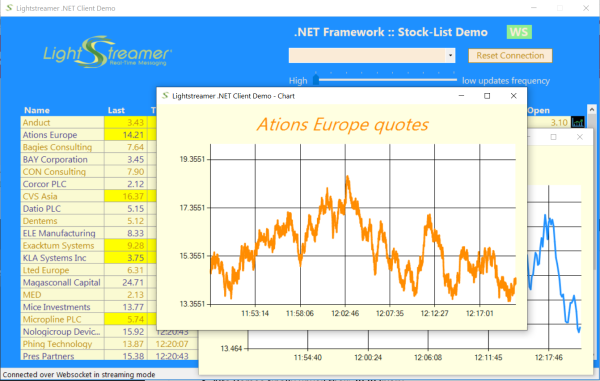

# Lightstreamer - Basic Stock-List Demo - .NET Client

<!-- START DESCRIPTION lightstreamer-example-stocklist-client-dotnet -->

This project contains a full example of a .NET Framework client application that employs the [.NET Standard client API for Lightstreamer](https://lightstreamer.com/temp/temp_dotnet_unified_docs/).

## Live Demo

 
### [ View live demo](https://demos.lightstreamer.com/DotNetDemo/deploy_push.zip) 
(download deploy_push.zip; unzip it; launch setup.exe; follow the instructions)

## Details

This is a .NET desktop version of the [Lightstreamer- Basic Stock-List Demo - HTML Client](https://github.com/Lightstreamer/Lightstreamer-example-Stocklist-client-javascript#basic-stock-list-demo---html-client), where thirty items are subscribed to. 

This app uses the <b>.NET Standard Client API for Lightstreamer</b> to handle the communications with Lightstreamer Server. A simple user interface is implemented to display the real-time data received from Lightstreamer Server.
The application uses a grid to display the real-time data. You can resize and drag the columns around.
 
This application uses the LightstreamerClient class to connect to Lightstreamer Server and subscribe to the 30 items. The client library offers auto-reconnection and auto-resubscription logic out of the box. The status of the connection can be seen on the top right corener or in the bottom statys bar of the demo. 
A *DataGridview* object from System.Windows.Forms is used to display the real-time updates received from Lightstreamer Server. The application code implements a cell highlighting mechanism, too.
<!-- END DESCRIPTION lightstreamer-example-stocklist-client-dotnet -->

## Install 

If you want to install a version of this demo pointing to your local Lightstreamer Server, follow these steps:

* Note that, as prerequisite, a windows system is required and the [Lightstreamer - Stock- List Demo - Java Adapter](https://github.com/Lightstreamer/Lightstreamer-example-Stocklist-adapter-java) has to be deployed on your local Lightstreamer Server instance. Please check out the project and follow the installation instructions provided with it.
* Launch Lightstreamer Server.
* Download the `deploy.zip` file that you can find in the [deploy release](https://github.com/Lightstreamer/Lightstreamer-example-StockList-client-dotnet/releases) of this project and extract the application installer (look for a `setup.exe` file).
* Execute the downloaded file `setup.exe` to install the application.
* From the Start menu, go to the "Lightstreamer .NET Stock-List Demo" folder, and click the "DotNetStockListDemo.exe" link.

## Build

To build your own version of the `DotNetStockListDemo.exe` executable, instead of using the one provided in the `deploy.zip` file from the Install section above, the example is comprised of the following source code and image files:
* `Source/*`
* `Properties/*`
* `Images/*`

To recompile the provided sources, you just need to create a project for a <b>Windows Application target</b>, then include the sources listed above.
You should complete this project with the [Lightstreamer .NET Standard Client library](https://www.nuget.org/packages/Lightstreamer.DotNetStandard.Client/5.0.0-beta), to be used for the build process, trough NuGet. Follow these steps:
  - In the "Solution Explorer" tab, right click on the project and choose `Manage NuGet Packages ...`
  - In the Search text box enter `Lightstreamer` and be sure to flag the *Include preliminary version* check-box
  - Choose the Lightstreamer.DotNetStandard.Client last version then click `Install` and then `Ok`
  - Check out that among the References of your project Lightstreamer_DotNet_Standard_Client was added.
 
Repeat the above steps also for "log4net" reference.

## See Also

### Lightstreamer Adapters Needed by These Demo Clients
<!-- START RELATED_ENTRIES -->

* [Lightstreamer - Stock-List Demo - Java Adapter](https://github.com/Lightstreamer/Lightstreamer-example-Stocklist-adapter-java)
* [Lightstreamer - Reusable Metadata Adapters - Java Adapter](https://github.com/Lightstreamer/Lightstreamer-example-ReusableMetadata-adapter-java)
* [Lightstreamer - Stock-List Demo - .NET Adapter](https://github.com/Lightstreamer/Lightstreamer-example-StockList-adapter-dotnet)

<!-- END RELATED_ENTRIES -->
### Related Projects

* [Lightstreamer - Stock-List Demos - HTML Clients](https://github.com/Lightstreamer/Lightstreamer-example-Stocklist-client-javascript)
* [Lightstreamer - Basic Stock-List Demo - jQuery (jqGrid) Client](https://github.com/Lightstreamer/Lightstreamer-example-StockList-client-jquery)
* [Lightstreamer - Basic Stock-List Demo - Java SE (Swing) Client](https://github.com/Lightstreamer/Lightstreamer-example-StockList-client-java)
* [Lightstreamer - Quickstart Example - .NET Client](https://github.com/Lightstreamer/Lightstreamer-example-Quickstart-client-dotnet)

## Lightstreamer Compatibility Notes

* Compatible with Lightstreamer .NET Standard Client Library version 5.0.0 or newer.
* Ensure that .NET Standard Client API is supported by Lightstreamer Server license configuration.
* For instructions compatible with .NET Standard Client library version 4.x, please refer to [this tag](https://github.com/Lightstreamer/Lightstreamer-example-StockList-client-dotnet/tree/deploy2)