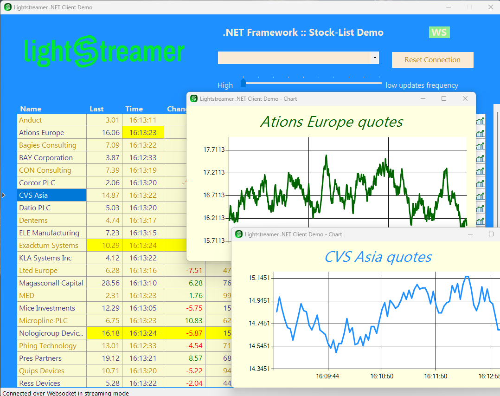

# Lightstreamer - Basic Stock-List Demo - .NET Client

<!-- START DESCRIPTION lightstreamer-example-stocklist-client-dotnet -->

This project contains a full example of a .NET client application that employs the [.NET client API for Lightstreamer](http://www.lightstreamer.com/docs/client_dotnet_api/frames.html).

## Live Demo

[](http://demos.lightstreamer.com/DotNetDemo/DotNetClientDemo_N2.msi)<br>
###[ View live demo](http://demos.lightstreamer.com/DotNetDemo/DotNetClientDemo_N2.msi)<br>
(download DotNetClientDemo_N2.msi; launch it; follow the instructions)

## Details

This is a .NET version of the [Lightstreamer- Basic Stock-List Demo - HTML Client](https://github.com/Weswit/Lightstreamer-example-Stocklist-client-javascript#basic-stock-list-demo---html-client), where thirty items are subscribed to.<br>

This app uses the <b>.NET Client API for Lightstreamer</b> to handle the communications with Lightstreamer Server. A simple user interface is implemented to display the real-time data received from Lightstreamer Server.
The application uses a grid to display the real-time data. You can resize and drag the columns around.
<!-- END DESCRIPTION lightstreamer-example-stocklist-client-dotnet -->

## Install 

If you want to install a version of this demo pointing to your local Lightstreamer Server, follow these steps:

* Note that, as prerequisite, the [Lightstreamer - Stock- List Demo - Java Adapter](https://github.com/Weswit/Lightstreamer-example-Stocklist-adapter-java) has to be deployed on your local Lightstreamer Server instance. Please check out that project and follow the installation instructions provided with it.
* Launch Lightstreamer Server.
* Download the `deploy.zip` file that you can find in the [deploy release](https://github.com/Weswit/Lightstreamer-example-StockList-client-dotnet/releases) of this project and extract the application installer (a ".msi" file).
* Execute the downloaded file `DotNetClientDemo_Local_N2.msi` to install the application.
* From the Start menu, go to the "Lightstreamer .NET Stock-List Demo" folder, click the "DotNetStockListDemo.exe" link.

## Build


To build your own version of the `DotNetStockListDemo.exe` executable, instead of using the one provided in the `deploy.zip` file from the Install section above, the example is comprised of the following source code and image files:
* `Source/*`
* `Properties/*`
* `Images/*`

To recompile the provided sources, you just need to create a project for a <b>Windows Application target</b>, then include the sources and include references to the .NET Client API for Lightstreamer binaries files `DotNetClient_N2.dll` and `DotNetClient_N2.pdb` from the [latest Lightstreamer  distribution](http://www.lightstreamer.com/download). You can find it in `/DOCS-SDKs/sdk_adapter_dotnet/lib` folder.

### Deploy

Once you have generated the Demo Client binaries (`DotNetClientDemo_N2.exe`) you should create a deploy folder, let's call it `Deployment`, and copy the binaries here. Then get the .NET Client API for Lightstreamer binaries files (see above) and put them in the `Deployment` folder.
Now you can prepare a  `DotNetClient.bat` launch script such this:
```cmd
@echo off

rem ---------------------------------------------------------------------------
rem Set the DotNet installation path as the current directory. Change the 
rem directory accordingly to your installation path of DotNet Adapter.

pushd .


rem ---------------------------------------------------------------------------
rem Start the StockList Demo Client, specifiyng to connect to the local
rem Lightstreamer Server instance.

start "DotNetStockListDemo" DotNetStockListDemo localhost 8080


rem ---------------------------------------------------------------------------
rem All done. Goes back to the original current directory and pauses, in case 
rem of any error.

echo Processes started. All done.
popd
pause
```

The `DotNetClientDemo_N2` executable can also be run by double-clicking it; in its default configuration, the client will try to connect to Lightstreamer server at http://localhost:80.
In this case the [QUOTE_ADAPTER](https://github.com/Weswit/Lightstreamer-example-Stocklist-adapter-java) and [LiteralBasedProvider](https://github.com/Weswit/Lightstreamer-example-ReusableMetadata-adapter-java) have to be deployed in your local Lightstreamer server instance. The factory configuration of Lightstreamer server already provides this adapter deployed.<br>

## See Also

### Lightstreamer Adapters Needed by These Demo Clients
<!-- START RELATED_ENTRIES -->

* [Lightstreamer - Stock-List Demo - Java Adapter](https://github.com/Weswit/Lightstreamer-example-Stocklist-adapter-java)
* [Lightstreamer - Reusable Metadata Adapters - Java Adapter](https://github.com/Weswit/Lightstreamer-example-ReusableMetadata-adapter-java)
* [Lightstreamer - Stock-List Demo - .NET Adapter](https://github.com/Weswit/Lightstreamer-example-StockList-adapter-dotnet)

<!-- END RELATED_ENTRIES -->
### Related Projects

* [Lightstreamer - Stock-List Demos - HTML Clients](https://github.com/Weswit/Lightstreamer-example-Stocklist-client-javascript)
* [Lightstreamer - Basic Stock-List Demo - jQuery (jqGrid) Client](https://github.com/Weswit/Lightstreamer-example-StockList-client-jquery)
* [Lightstreamer - Stock-List Demo - Dojo Toolkit Client](https://github.com/Weswit/Lightstreamer-example-StockList-client-dojo)
* [Lightstreamer - Basic Stock-List Demo - Java SE (Swing) Client](https://github.com/Weswit/Lightstreamer-example-StockList-client-java)
* [Lightstreamer - Portfolio Demo - Flex Client](https://github.com/Weswit/Lightstreamer-example-Portfolio-client-flex)

## Lightstreamer Compatibility Notes

* Compatible with Lightstreamer .NET Client Library version 2.1 or newer.
* For Lightstreamer Allegro (+ .NET Client API support), Presto, Vivace.
